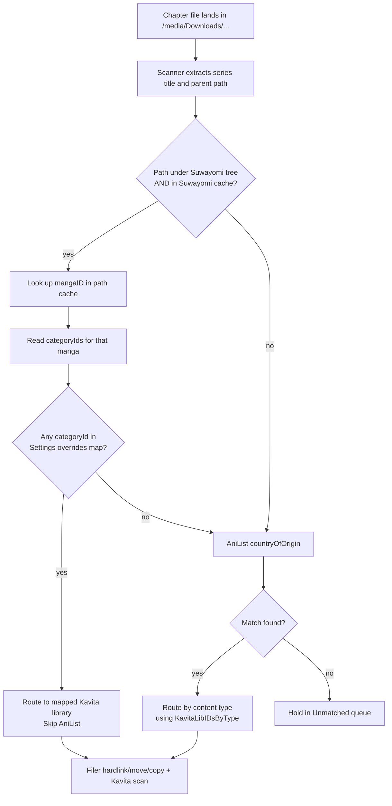

# Library Map: Suwayomi Category Overrides

> Spec for the Settings → Library Map feature. Replaces the existing "Kavita Libraries" section with a two-card layout: AniList classification stays as the default, Suwayomi categories become an opt-in override path.

## North star — what should be true

When this is done, the following statements are verifiable against the running system:

1. **A series downloaded by Suwayomi into a category mapped in Settings lands in the chosen Kavita library without consulting AniList.**
2. **A series outside any mapped Suwayomi category (or downloaded by Tranga, or dropped manually) is classified by the existing AniList `countryOfOrigin` path.**
3. **The Settings page shows a Suwayomi connection panel alongside the Kavita connection panel, with a Test button that confirms reachability and reports the number of categories the configured account can see.**
4. **The Settings page shows a Library Map section split into two cards: "Default: AniList Classification" (the existing Manga/Manhwa/Manhua → Kavita library mapping) and "Suwayomi Category Overrides" (rows mapping each Suwayomi category to a Kavita library).**
5. **Changing the Suwayomi URL or credentials at runtime takes effect on the next handler call without a pod restart** — same fresh-per-call pattern as the Kavita client fix in PR #28.
6. **Tranga's classification behaviour does not change.** No Tranga connection panel, no Tranga overrides — Tranga downloads keep going through AniList exactly as they do today.
7. **An unreachable Suwayomi does not block file routing.** Cache miss → fall through to AniList. Suwayomi outage degrades the system to current behaviour, not below it.

## Findings — what's true now

- The classifier (`internal/classifier`) consults AniList for `countryOfOrigin` after extracting the series title from ComicInfo.xml (or the folder name fallback). `JP → Manga`, `KR → Manhwa`, `CN/TW → Manhua`. Anything else → Unmatched queue.
- Settings already holds `KavitaLibIDsByType map[ContentType]int64` — three rows for the three content types. Surface is rendered by `pageSettings` and the "Kavita Libraries" section of `internal/web/templates/settings.html`.
- Suwayomi supports four `server.authMode` values: `none` (no auth), `basic_auth` (HTTP Basic), `simple_login` (POST `/api/v1/auth/login` with JSON credentials → returns a session cookie / bearer token used on subsequent requests), and `ui_login` (JWT-based flow used by the modern web UI). mangarr is a public release, so all four are in-scope.
- Suwayomi exposes a stable REST API at `/api/v1/...` and a GraphQL API at `/api/graphql`. Categories live at `GET /api/v1/category` and return `[{id, name, order, default, includeInUpdate}]`. Mangas-in-library + their categories are reachable via GraphQL (`mangaList(inLibrary: true)`) or `GET /api/v1/category/{id}` for the per-category list.
- Tranga has no equivalent "category" concept — its model is per-series tracking on connectors (MangaDex, AsuraScans, etc.), which conflate languages, so connector-to-type would be a weak signal.
- The Kavita client pattern (PR #28 follow-up): user-editable connection params must be read from Settings per request, not captured at boot. See `[[reference-settings-driven-clients-fresh-per-call]]`.

## Flow — how a chapter file gets routed



Stages:

1. **Scan.** Existing scanner walks the Downloads roots, extracts title from ComicInfo or folder name. Unchanged.
2. **Suwayomi path lookup (new).** If the file's parent directory is inside a Suwayomi download root *and* the in-memory Suwayomi cache has an entry for that parent path, lift the `categoryIds` for that manga.
3. **Override check (new).** Walk `categoryIds` against `Settings.SuwayomiCategoryOverrides`. First match wins. If any category is mapped → route to the chosen Kavita library, record `via="suwayomi-override:<categoryName>"` in the activity log, skip AniList.
4. **AniList fallback.** No override hit (or file is not from Suwayomi): existing AniList path.
5. **File + scan.** Existing filer + Kavita scan trigger. Unchanged.

Failure modes:

- **Suwayomi cache empty / stale.** First poll after start, or after Suwayomi has been unreachable: cache miss for every Suwayomi file → AniList fallback. Acceptable.
- **Suwayomi unreachable during cache refresh.** Previous cache contents stay valid. Activity log records `suwayomi: refresh failed: <error>` once per failed attempt.
- **Manga in category, category in overrides, but Kavita library no longer exists.** Filer fails on the missing library at scan-trigger time → existing Kavita-error handling path (recorded, Unmatched). No change to error handling here.
- **Series in multiple mapped categories.** Deterministic resolution by category order from Suwayomi (`order` field). First mapped category wins. Surfaced in activity log so the user can audit.

## Design

### Settings model additions

```go
// internal/model/settings.go
type Settings struct {
    // ... existing fields ...

    // Suwayomi connection (user-editable; do not capture at boot)
    SuwayomiBaseURL  string             // e.g. http://suwayomi.downloads.svc.cluster.local:4567
    SuwayomiAuthType SuwayomiAuthType   // "none" | "basic" | "simple" | "ui"
    SuwayomiUsername string             // empty when auth_type == "none"
    SuwayomiPassword string             // empty when auth_type == "none"

    // Category overrides: Suwayomi categoryID → Kavita libraryID
    // First match in evaluation order wins (see flow).
    // Empty map = feature disabled = pure AniList classification.
    SuwayomiCategoryOverrides map[int64]int64
}

type SuwayomiAuthType string

const (
    SuwayomiAuthNone   SuwayomiAuthType = "none"
    SuwayomiAuthBasic  SuwayomiAuthType = "basic"
    SuwayomiAuthSimple SuwayomiAuthType = "simple"  // simple_login flow
    SuwayomiAuthUI     SuwayomiAuthType = "ui"      // ui_login flow
)
```

`SuwayomiCategoryOverrides` is a `map[int64]int64`, not a slice of structs, to keep lookup O(1) at file-time and reflect the fact that any given Suwayomi category maps to at most one Kavita library.

All four Suwayomi `authMode` values are first-class. `simple` and `ui` involve a login round-trip and a server-issued token/cookie that must be cached and refreshed on 401 — design details in the Suwayomi client section below.

### Suwayomi client (`internal/suwayomi/suwayomi.go`)

Mirrors the Kavita client shape:

```go
type Client struct {
    base string
    auth Auth
    http *http.Client
}

// Auth is implemented by all four Suwayomi auth modes. Apply mutates the
// request to carry the right header/cookie. EnsureSession is a no-op for
// stateless modes (none, basic) and performs the login round-trip for
// session-bearing modes (simple, ui) when the cached token is absent or
// the most recent response was 401.
type Auth interface {
    Apply(ctx context.Context, req *http.Request) error
    EnsureSession(ctx context.Context, base string, httpClient *http.Client) error
    Invalidate()  // called on 401 so the next request re-logs in
}

type Category struct {
    ID    int64  `json:"id"`
    Name  string `json:"name"`
    Order int    `json:"order"`
}

type Manga struct {
    ID          int64   `json:"id"`
    Title       string  `json:"title"`
    SourceID    string  `json:"sourceId"`
    Source      string  // synthesised display name, e.g. "MangaDex (en)"
    DownloadDir string  // on-disk path relative to Suwayomi's downloads root, derived
    CategoryIDs []int64
}

func New(base string, auth Auth) *Client
func (c *Client) Ping(ctx context.Context) error                 // for the Test button
func (c *Client) ListCategories(ctx context.Context) ([]Category, error)
func (c *Client) ListLibraryWithCategories(ctx context.Context) ([]Manga, error)
```

Clients are built **fresh per request** in handlers and per poll tick in the cache refresher. Settings → Client construction happens at the call site, not at boot. No long-lived field on the Poller or Handler.

`ListLibraryWithCategories` is the new build-the-cache call. It returns one row per manga in the user's library, with its categoryIDs eagerly loaded. Implementation uses GraphQL (single round-trip) rather than fanning out per-category REST calls.

#### Auth implementations

| Mode | `Apply` | `EnsureSession` | `Invalidate` |
|---|---|---|---|
| `none` | no-op | no-op | no-op |
| `basic` | sets `Authorization: Basic <base64(user:pass)>` on every request | no-op | no-op |
| `simple` | sets `Authorization: Bearer <cached-token>` if present, else returns error so the caller knows to call `EnsureSession` first | POSTs `{username, password}` JSON to `/api/v1/auth/login`, caches the returned token | clears the cached token |
| `ui` | sets `Authorization: Bearer <cached-jwt>` if present, else returns error | POSTs to the UI login endpoint, caches the returned JWT; refreshes via the refresh endpoint if the JWT is close to expiry | clears the cached JWT |

The session-bearing Auth implementations (`simple`, `ui`) keep their cached token in the `Auth` instance itself, which lives inside the `Client`. Because clients are fresh-per-request/per-tick, the token persists only for the duration of one logical operation — handler call or poll tick. This trades a small amount of extra login traffic (one login per tick) for never having to invalidate or share session state across goroutines.

`Client` request methods call `EnsureSession` once at the top, then make the actual API call. On `401` they call `Invalidate()`, re-call `EnsureSession`, and retry exactly once. Two consecutive 401s surface as an auth error to the caller.

The exact endpoint paths and payload shapes for `simple_login` and `ui_login` are verified against the running Suwayomi (or its docs) at implementation time — the spec deliberately does not freeze the byte-level contract before then.

### Suwayomi path cache (`internal/suwayomi/cache.go`)

In-memory, lock-protected, no SQLite persistence. Lifetime is the process lifetime.

```go
type PathCache struct {
    mu      sync.RWMutex
    entries map[string]CacheEntry  // key = canonical on-disk parent dir
}

type CacheEntry struct {
    MangaID     int64
    Title       string
    CategoryIDs []int64
    RefreshedAt time.Time
}

func (c *PathCache) Refresh(ctx context.Context, client *Client, downloadRoots []string) error
func (c *PathCache) Lookup(parentDir string) (CacheEntry, bool)
```

`Refresh` is called once at startup (best-effort, errors logged) and at the top of each poller tick. `Lookup` is the file-time hot path.

The cache key is the **canonical, cleaned absolute path of the parent directory** of the chapter file (`filepath.Clean(filepath.Dir(chapterPath))`). To build cache entries, the refresher joins each Suwayomi-side `DownloadDir` with each configured Downloads root and stores both the joined and the `filepath.Clean`-ed forms.

Cache miss → fall through to AniList. No retry-on-miss inside the same poll tick.

### Classifier change (`internal/classifier`)

The classifier gains one new step before the existing AniList path:

```go
type Classifier struct {
    anilist  *anilist.Client
    suwayomi *suwayomi.PathCache  // nil-safe; nil cache = override path disabled
    settings store.SettingsReader
}

func (c *Classifier) Classify(ctx context.Context, item ScanItem) (Decision, error) {
    if c.suwayomi != nil {
        if entry, ok := c.suwayomi.Lookup(item.ParentDir); ok {
            settings, _ := c.settings.GetSettings()
            // First-match-wins, ordered by Suwayomi category.order
            for _, catID := range entry.CategoryIDs {
                if libID, mapped := settings.SuwayomiCategoryOverrides[catID]; mapped {
                    return Decision{
                        Route: RouteSuwayomiOverride,
                        KavitaLibraryID: libID,
                        Reason: fmt.Sprintf("suwayomi-override:category=%d", catID),
                    }, nil
                }
            }
        }
    }
    return c.classifyViaAniList(ctx, item)
}
```

`entry.CategoryIDs` must be returned by `PathCache.Lookup` in the same order Suwayomi reports them (sorted by `category.order` ascending). The classifier walks the slice; first override match wins. This makes the resolution deterministic and auditable.

The `RouteSuwayomiOverride` route is new; the existing `RouteByContentType` and `RouteUnmatched` routes are unchanged.

### Web endpoints

New routes, all built on fresh-per-call Suwayomi clients:

| Method | Path | Purpose |
|---|---|---|
| GET | `/api/suwayomi/test` | Test button — ping the configured Suwayomi, report status + category count |
| GET | `/api/suwayomi/categories` | JSON list of categories for the JSON API |
| GET | `/api/suwayomi/categories/fragment` | HTMX swap target — populated `<option>` lists for the override dropdowns |

The existing Kavita endpoints (`/api/kavita/libraries[/fragment]`, `/api/kavita/test`) keep their current shape.

### UI shape (Sectioned layout, picked 2026-05-30)

Settings → **Connections** card stack grows a sibling for Kavita:

```
+-- Suwayomi Connection ---------------------+
| Base URL  [http://suwayomi.entertainment...|
| Auth      ( ) None   (o) Basic            |
| Username  [admin                         ] |
| Password  [********                      ] |
|             [Test] o connected, 12 categs  |
+--------------------------------------------+
```

Settings → renamed from "Kavita Libraries" to **Library Map**, split into two sub-cards:

```
+-- Default: AniList Classification ---------+
| Japanese (JP)    ->  [Kavita: Manga    v]  |
| Korean (KR)      ->  [Kavita: Manhwa   v]  |
| Chinese (CN, TW) ->  [Kavita: Manhua   v]  |
| Unmatched        ->  [Hold for review  v]  |  <- existing behaviour
+--------------------------------------------+

+-- Suwayomi Category Overrides ----[+ Add]--+
| When a series comes from a Suwayomi        |
| category below, route there instead of     |
| asking AniList.                            |
+--------------------------------------------+
| Korean Webtoons  ->  [Kavita: Manhwa   v]  |
| Japanese Manga   ->  [Kavita: Manga    v]  |
| Chinese Manhua   ->  [Kavita: Manhua   v]  |
| (others fall through to AniList above)     |
+--------------------------------------------+
      [Refresh categories from Suwayomi]
```

`+ Add` adds a row: a category dropdown (populated from `/api/suwayomi/categories/fragment`) and a Kavita library dropdown (reuses the picker from PR #28). Each row has a Delete affordance. Saved-but-unknown categories render as `Unknown (ID: N)` so the user can re-pick after Suwayomi-side renames or deletes, mirroring the Kavita library picker's degraded state.

The "Refresh categories from Suwayomi" button triggers `PathCache.Refresh` and re-renders the override card so newly-added Suwayomi categories appear in the dropdown.

### Activity log

Add one new route value to the existing typed-event surface:

```go
type ActionRouted struct {
    Series          string
    Via             string  // "suwayomi-override:category=Korean Webtoons" | "anilist:JP" | ...
    KavitaLibraryID int64
}
```

The existing `ActionFiled` event keeps its current shape; `Via` is added so users can audit which path classified each series. No DB migration — activity records are append-only and the new field is optional.

### What does not change

- `internal/poller` orchestration, except that it gets a `*suwayomi.PathCache` and calls `Refresh` at the top of each tick.
- `internal/filer` — hardlink/move/copy logic, path-traversal guard, idempotency.
- `internal/kavita` — already in good shape after PR #28/#29.
- `internal/store` — Settings already round-trips JSON; the new fields slot in.
- Tranga handling. No Tranga client, no Tranga UI, no Tranga overrides. AniList stays the path.

### Out of scope (backlog)

- Push-style integration with Suwayomi (webhooks, polling its download-complete events).
- Per-series overrides ("this specific Solo Leveling instance goes to X library").
- A "suggest mappings" feature that pre-fills the override table from current Suwayomi categories.
- Migrating existing Unmatched entries when a new override is added.

## Plan — truth statements

Three plan batches, each independently shippable. EARS syntax; agents verify each statement against the running system.

### Plan A — Suwayomi client and cache (no UI yet)

- **The `internal/suwayomi` package shall expose a `Client` type with `Ping`, `ListCategories`, and `ListLibraryWithCategories` methods.**
- **When the Suwayomi `authMode` is `"none"`, the client shall send no `Authorization` header.**
- **When the Suwayomi `authMode` is `"basic"`, the client shall send `Authorization: Basic <base64(user:pass)>` on every request.**
- **When the Suwayomi `authMode` is `"simple"`, the client shall obtain a session token via the Suwayomi `simple_login` flow before any other request, and shall present that token as `Authorization: Bearer <token>` on every subsequent request.**
- **When the Suwayomi `authMode` is `"ui"`, the client shall obtain a JWT via the Suwayomi `ui_login` flow before any other request, and shall present that JWT as `Authorization: Bearer <jwt>` on every subsequent request.**
- **If a request returns `401 Unauthorized`, the client shall invalidate the cached session token (if any), re-authenticate, and retry the original request exactly once.**
- **If the second attempt also returns `401`, the client shall return an authentication error to the caller.**
- **`ListCategories` shall return categories sorted ascending by Suwayomi's `order` field.**
- **`ListLibraryWithCategories` shall return one entry per manga in the user's library, with `CategoryIDs` populated and the same `order` ordering.**
- **The `PathCache` shall expose `Refresh(ctx, client, downloadRoots)` and `Lookup(parentDir)` methods.**
- **After `Refresh` completes successfully, `Lookup` shall return the cached entry for any canonical-cleaned parent directory derived from a Suwayomi-side `DownloadDir` joined against any of the supplied `downloadRoots`.**
- **When `Refresh` fails, previously-cached entries shall remain available to `Lookup`.**
- **`Lookup` shall be safe to call concurrently with `Refresh`.**

Verification: unit tests against `httptest.Server` stubs that mimic Suwayomi's REST and GraphQL surfaces. No live cluster required.

### Plan B — Classifier integration and Settings persistence

- **`Settings` shall include `SuwayomiBaseURL`, `SuwayomiAuthType`, `SuwayomiUsername`, `SuwayomiPassword`, and `SuwayomiCategoryOverrides` fields.**
- **The settings store shall round-trip `SuwayomiCategoryOverrides` through JSON without lossy conversion.**
- **While `SuwayomiCategoryOverrides` contains at least one entry AND the `PathCache` has an entry matching the file's parent directory, the classifier shall route the file using the first matching override before consulting AniList.**
- **If no override matches OR the `PathCache` has no entry for the parent directory, the classifier shall use the existing AniList `countryOfOrigin` path.**
- **When the classifier routes via override, the resulting activity log entry shall carry `Via = "suwayomi-override:category=<name>"`.**
- **When the classifier routes via AniList, the resulting activity log entry shall carry `Via = "anilist:<countryCode>"`.**
- **The poller shall call `PathCache.Refresh` at the top of each tick.**
- **If Suwayomi is unreachable during a poller tick, the tick shall continue and rely on previously-cached entries (or fall through to AniList for cache misses).**

Verification: classifier unit tests with a fake `PathCache` and fake `anilist.Client`. Poller integration test confirming a Refresh failure does not abort the tick.

### Plan C — UI and web endpoints

- **The Settings page shall render a Suwayomi Connection panel below the Kavita Connection panel.**
- **The Suwayomi Connection panel shall include URL, auth-type, username, password, and a Test button.**
- **When the Test button is pressed AND the configured Suwayomi is reachable, the panel shall display `● connected, N categories`.**
- **When the Test button is pressed AND the configured Suwayomi is unreachable, the panel shall display the error returned by the Suwayomi client, without leaking the API base URL or password.**
- **The Settings page shall rename the "Kavita Libraries" section to "Library Map".**
- **The Library Map section shall contain a "Default: AniList Classification" sub-card retaining the existing Manga/Manhwa/Manhua dropdowns.**
- **The Library Map section shall contain a "Suwayomi Category Overrides" sub-card with one row per entry in `SuwayomiCategoryOverrides`.**
- **Each override row shall offer a category dropdown (populated from Suwayomi) and a Kavita library dropdown (populated from Kavita), plus a Delete affordance.**
- **An "Add" affordance shall append a new empty row to the override card; saving the form shall persist any rows with both fields populated.**
- **A row referencing a Suwayomi category that the configured Suwayomi no longer reports shall render as `Unknown (ID: N)` and remain editable.**
- **`GET /api/suwayomi/test`, `GET /api/suwayomi/categories`, and `GET /api/suwayomi/categories/fragment` shall each build a fresh Suwayomi client from the current Settings on every call.**
- **When the configured Suwayomi base URL is empty, the override sub-card shall render an inline prompt directing the user to configure the connection panel above, without making any outbound network call.**

Verification: existing web tests pattern (`httptest`-backed Kavita stub + new Suwayomi stub) plus a Playwright screenshot of the live Settings page in the dev container.

## Open questions

None blocking. Two deferred-to-implementation choices:

- **Suwayomi credentials at rest.** Stored as plain strings in the SQLite settings row, like the Kavita API key. Operator-trusted store; no encryption at rest. Same threat model as the Kavita key.
- **Download-roots overlap.** A user could configure both `/media/Downloads/suwayomi` and `/media/Downloads` (the parent) as Downloads roots. The Suwayomi path cache normalises with `filepath.Clean`, so prefix matches still resolve. If both match, the more specific (longest matching prefix) wins.

## References

- `docs/DESIGN.md` — overall mangarr design and the AniList classification path this builds on.
- `docs/plans/2026-05-28-mangarr-mvp.md` — MVP plan; Library Map sits in the "post-MVP enhancements" tier.
- PR #28 (`feat(web,kavita): pick Kavita libraries from a synced dropdown`) — established the Settings dropdown-from-API pattern and the fresh-per-call client rule.
- PR #29 (`fix(kavita): list libraries via /api/Library/Libraries`) — proved out the kubectl-exec-with-wget probe technique for verifying external API shapes in cluster.
